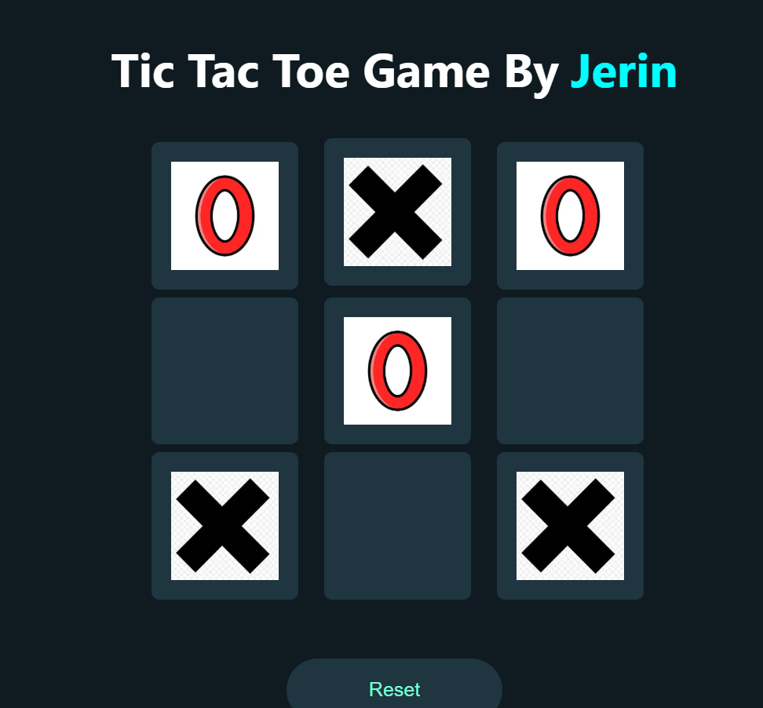

🎮 Tic Tac Toe Game – React.js

A simple, interactive, and visually appealing Tic Tac Toe game built using React.js.
The game supports two players (X and O), detects wins, handles ties, highlights the winning pattern, and includes a reset option for replay.

🚀 Features

🔄 Two-player gameplay (X and O)
🧠 Automatic win detection (all 8 possible win combinations)
🤝 Tie detection when the board is full
⭐ Winning boxes shrink to indicate the winner visually
🖼 Larger symbols during gameplay for better visibility
🔒 Board locks after a win or tie (prevents extra clicks)
🔁 Reset button to restart the game instantly
🎨 Custom-designed UI with smooth interactions

🛠 Technologies Used

React.js
JavaScript (ES6)
CSS3

Image assets (X and O icons)

📂 Project Structure
/tictactoe
│── src
│   ├── components
│   │   └── TicTacToe.jsx
│   ├── assets
│   │   ├── x.png
│   │   └── o.png
│   ├── styles
│   │   └── TicTacToe.css
│   └── index.js
└── README.md

🎯 How to Play
Player X starts the game.
Click any empty box to place your symbol.
The game checks for:
A win
A tie
If someone wins, the title displays the winner’s symbol.
If a tie happens, the title shows "Game Tied".

Press Reset to start a new match.

📸 Screenshot

🧪 Future Enhancements (Optional)

Add score tracking (X wins, O wins, tie count)
Add sound effects for move, win, tie
Add an AI mode (play against computer)
Add animations for symbol placement
Add dark/light themes
